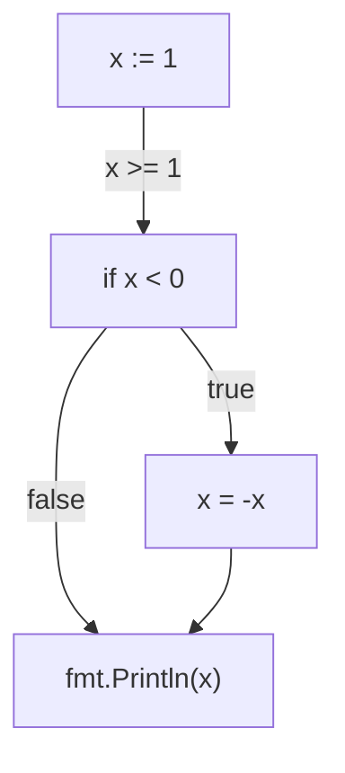

# analyzer executable 입출력 형식

JSON 형식으로 출력

출력 종류:
1. CFG 출력: `./analyzer input.go --print-cfg` 로 호출. 코드에 대응되는 그래프의 정점과 간선 정보 출력. 정점에 대응되는 코드 줄 번호를 입력하여 정점을 클릭하거나 코드 줄을 클릭하면 서로 하이라이트 되게끔 구현.
2. 분석 중간단계 업데이트: 분석이 진행되는 동안 그래프/도메인상의 정보가 단계별로 업데이트 되는 정보 생성. 그래프의 정점들의 label 정보 업데이트 요청.
3. 최종 분석 결과: 분석이 완료된 후, 탐지된 오류의 발생 위치(노드 번호)와 유형, 정보 반환

## Control Flow Graph output

```
./analyzer input.go --print-cfg
```

JSON Format

```
{
    "nodes" : [
        {
            "id" : 1,
            "code" : "x := 1",
            "type" : "basic",
            "line_num" : 1
        },
        {
            "id": 2,
            "code" : "if x < 0",
            "type" : "branch",
            "line_num" : 2
        },
        {
            "id": 3,
            "code": "x = -x",
            "type" : "basic",
            "line_num" : 3
        },
        {
            "id": 4,
            "code": "fmt.Println(x)",
            "type" : "basic",
            "line_num" : 4
        },
    ],
    "edges" : [
        {
            "id" : 1,
            "from_node_id" : 1,
            "to_node_id" : 2,
        },
        {
            "id" : 2,
            "from_node_id" : 2,
            "to_node_id" : 3,
            "label" : "true",
        },
        {
            "id" : 3,
            "from_node_id" : 2,
            "to_node_id" : 4,
            "label" : "false",
        },
        {
            "id" : 4,
            "from_node_id" : 3,
            "to_node_id" : 4,
        },
    ]
}
```

Frontend should generate:



## Analysis progress output

Updates to node text/code.

## Analysis result output
