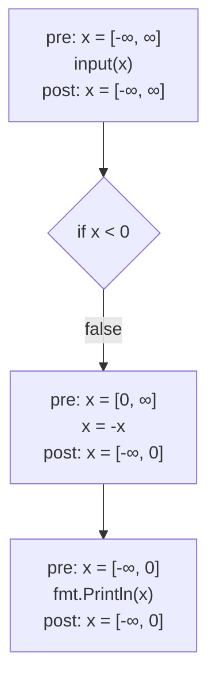

# TraceInspector 
# analyzer executable 입출력 형식

JSON 형식으로 출력

출력 종류:
1. CFG 출력: `./analyzer --gofile input.go --print-cfg` 로 호출. 코드에 대응되는 그래프의 정점과 간선 정보 출력. 정점에 대응되는 코드 줄 번호를 입력하여 정점을 클릭하거나 코드 줄을 클릭하면 서로 하이라이트 되게끔 구현.
2. 분석 중간단계 업데이트: 분석이 진행되는 동안 그래프/도메인상의 정보가 단계별로 업데이트 되는 정보 생성. 그래프의 정점들의 label 정보 업데이트 요청.
3. 최종 분석 결과: 분석이 완료된 후, 탐지된 오류의 발생 위치(노드 번호)와 유형, 정보 반환

## Control Flow Graph output

```
./analyzer --gofile input.go --print-cfg
```

`node_type` :
- "basic" (사각형)
- "cond" (마름모)

Input code
```go
func main(){
    var x int
    fmt.Scan(&x)
    if x < 0 {

    } else {
        x = -x
    }
    fmt.Println(x)
}
```

JSON Format

generates a CFG graph for every function defined in the file.

```
{
  "main": {
    "Nodes": [
      {
        "Id": 1,
        "Code": "var x int",
        "Node_type": "basic",
        "Line_num": 6
      },
      {
        "Id": 2,
        "Code": "fmt.Scan(\u0026x)",
        "Node_type": "basic",
        "Line_num": 7
      },
      {
        "Id": 3,
        "Code": "x \u003c 0",
        "Node_type": "cond",
        "Line_num": 8
      },
      {
        "Id": 4,
        "Code": "{\n\tx = -x\n}",
        "Node_type": "basic",
        "Line_num": 10
      },
      {
        "Id": 5,
        "Code": "fmt.Println(x)",
        "Node_type": "basic",
        "Line_num": 13
      }
    ],
    "Edges": [
      {
        "Id": 0,
        "From_node_id": 1,
        "To_node_id": 2,
        "Label": ""
      },
      {
        "Id": 1,
        "From_node_id": 2,
        "To_node_id": 3,
        "Label": ""
      },
      {
        "Id": 2,
        "From_node_id": 3,
        "To_node_id": 4,
        "Label": "false"
      },
      {
        "Id": 3,
        "From_node_id": 3,
        "To_node_id": 5,
        "Label": ""
      }
    ]
  }
}
```

Frontend should generate:



## Analysis progress output

Updates to node text/code.

## Analysis result output
