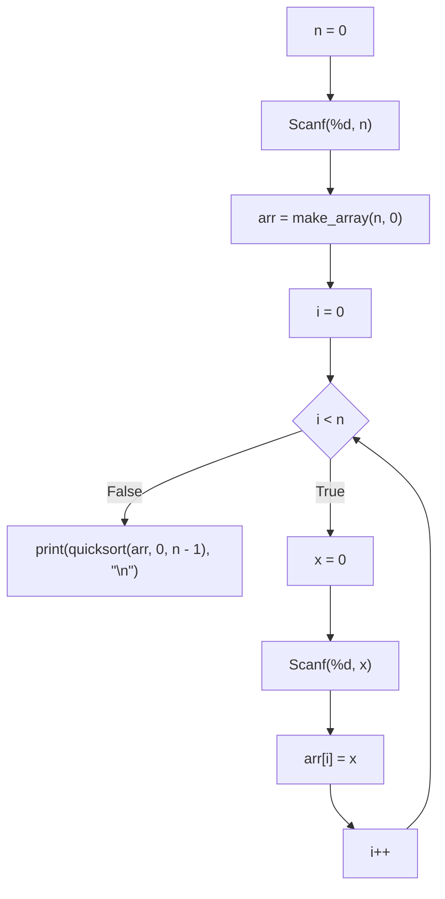
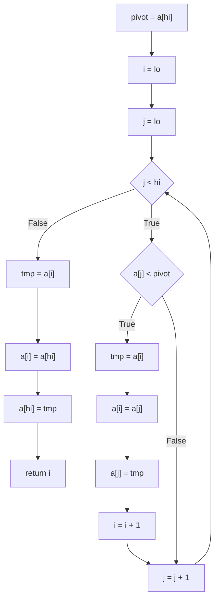
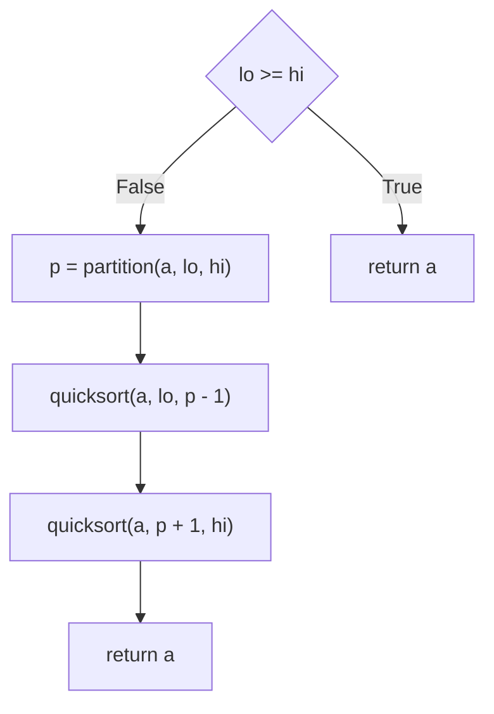

# TraceInspector 
# analyzer executable 입출력 형식

출력 종류:

1. CFG JSON으로 출력: `./traceinspector --gofile input.go --print-cfg-json` 로 호출. 코드에 대응되는 그래프의 정점과 간선 정보 출력. 정점에 대응되는 코드 줄 번호를 입력하여 정점을 클릭하거나 코드 줄을 클릭하면 서로 하이라이트 되게끔 구현.
2. CFG Mermaid로 출력: `./traceinspector --gofile input.go --print-cfg-mermaid` 로 호출. JSON형태와 동등한 그래프를 Mermaid 코드로 출력.
3. Go -> Imp 번역: `./traceinspector --gofile input.go --print-imp` 로 호출. 입력 Go 코드에 대응되는 Imp 코드 출력.
4. Go -> Imp 번역 후 실행: `./traceinspector --gofile input.go --interpret-imp` 로 호출. 입력 Go 코드에 대응되는 Imp 코드 생성 후 실행(interpretation).


## 종류별 출력 예시

`node_type` :
- "basic" (사각형)
- "cond" (마름모)

### Input code

```go
//go:build ignore

package main

import "fmt"

func main() {
	x := 0
	fmt.Print("Enter non-negative integer:")
	fmt.Scanf("%d", x)
	for i := x; i > 0; i-- {
		if i%2 == 0 {
			if i%3 == 0 {
				fmt.Print(i, "is a multiple of 2 and 3\n")
			} else {
				fmt.Print(i, "is a multiple of 2 and not a multiple of 3\n")
			}
		} else if i%3 == 0 {
			fmt.Print(i, "is not a multiple of 2, but a multiple of 3 \n")
		} else {
			fmt.Print(i, "is not a multiple of both 2 and 3\n")
		}
	}
	fmt.Print("Done", x)
}
```

### CFG JSON Format

generates a CFG graph for every function defined in the file.

```
{
    "main": {
        "Nodes": [
            {
                "Id": {
                    "Function_name": "main",
                    "Id": 1
                },
                "Code": "print(quicksort(arr, 0, n - 1), #34;\\n#34;)",
                "Node_type": "basic",
                "Line_num": 53
            },
            {
                "Id": {
                    "Function_name": "main",
                    "Id": 2
                },
                "Code": "i < n",
                "Node_type": "cond",
                "Line_num": 48
            },
            {
                "Id": {
                    "Function_name": "main",
                    "Id": 3
                },
                "Code": "i++",
                "Node_type": "basic",
                "Line_num": 48
            },
            {
                "Id": {
                    "Function_name": "main",
                    "Id": 4
                },
                "Code": "arr[i] = x",
                "Node_type": "basic",
                "Line_num": 51
            },
            {
                "Id": {
                    "Function_name": "main",
                    "Id": 5
                },
                "Code": "Scanf(%d, x)",
                "Node_type": "basic",
                "Line_num": 50
            },
            {
                "Id": {
                    "Function_name": "main",
                    "Id": 6
                },
                "Code": "x = 0",
                "Node_type": "basic",
                "Line_num": 49
            },
            {
                "Id": {
                    "Function_name": "main",
                    "Id": 7
                },
                "Code": "i = 0",
                "Node_type": "basic",
                "Line_num": 48
            },
            {
                "Id": {
                    "Function_name": "main",
                    "Id": 8
                },
                "Code": "arr = make_array(n, 0)",
                "Node_type": "basic",
                "Line_num": 47
            },
            {
                "Id": {
                    "Function_name": "main",
                    "Id": 9
                },
                "Code": "Scanf(%d, n)",
                "Node_type": "basic",
                "Line_num": 46
            },
            {
                "Id": {
                    "Function_name": "main",
                    "Id": 10
                },
                "Code": "n = 0",
                "Node_type": "basic",
                "Line_num": 45
            }
        ],
        "Edges": [
            {
                "Id": {
                    "Function_name": "main",
                    "Id": 0
                },
                "From_node_id": 3,
                "To_node_id": 2,
                "Label": ""
            },
            {
                "Id": {
                    "Function_name": "main",
                    "Id": 1
                },
                "From_node_id": 4,
                "To_node_id": 3,
                "Label": ""
            },
            {
                "Id": {
                    "Function_name": "main",
                    "Id": 2
                },
                "From_node_id": 5,
                "To_node_id": 4,
                "Label": ""
            },
            {
                "Id": {
                    "Function_name": "main",
                    "Id": 3
                },
                "From_node_id": 6,
                "To_node_id": 5,
                "Label": ""
            },
            {
                "Id": {
                    "Function_name": "main",
                    "Id": 4
                },
                "From_node_id": 2,
                "To_node_id": 6,
                "Label": "True"
            },
            {
                "Id": {
                    "Function_name": "main",
                    "Id": 5
                },
                "From_node_id": 2,
                "To_node_id": 1,
                "Label": "False"
            },
            {
                "Id": {
                    "Function_name": "main",
                    "Id": 6
                },
                "From_node_id": 7,
                "To_node_id": 2,
                "Label": ""
            },
            {
                "Id": {
                    "Function_name": "main",
                    "Id": 7
                },
                "From_node_id": 8,
                "To_node_id": 7,
                "Label": ""
            },
            {
                "Id": {
                    "Function_name": "main",
                    "Id": 8
                },
                "From_node_id": 9,
                "To_node_id": 8,
                "Label": ""
            },
            {
                "Id": {
                    "Function_name": "main",
                    "Id": 9
                },
                "From_node_id": 10,
                "To_node_id": 9,
                "Label": ""
            }
        ]
    },
    "partition": {
        "Nodes": [
            {
                "Id": {
                    "Function_name": "partition",
                    "Id": 1
                },
                "Code": "return i",
                "Node_type": "basic",
                "Line_num": 29
            },
            {
                "Id": {
                    "Function_name": "partition",
                    "Id": 2
                },
                "Code": "a[hi] = tmp",
                "Node_type": "basic",
                "Line_num": 27
            },
            {
                "Id": {
                    "Function_name": "partition",
                    "Id": 3
                },
                "Code": "a[i] = a[hi]",
                "Node_type": "basic",
                "Line_num": 26
            },
            {
                "Id": {
                    "Function_name": "partition",
                    "Id": 4
                },
                "Code": "tmp = a[i]",
                "Node_type": "basic",
                "Line_num": 25
            },
            {
                "Id": {
                    "Function_name": "partition",
                    "Id": 5
                },
                "Code": "j < hi",
                "Node_type": "cond",
                "Line_num": 12
            },
            {
                "Id": {
                    "Function_name": "partition",
                    "Id": 6
                },
                "Code": "j = j + 1",
                "Node_type": "basic",
                "Line_num": 21
            },
            {
                "Id": {
                    "Function_name": "partition",
                    "Id": 7
                },
                "Code": "a[j] < pivot",
                "Node_type": "cond",
                "Line_num": 13
            },
            {
                "Id": {
                    "Function_name": "partition",
                    "Id": 8
                },
                "Code": "i = i + 1",
                "Node_type": "basic",
                "Line_num": 19
            },
            {
                "Id": {
                    "Function_name": "partition",
                    "Id": 9
                },
                "Code": "a[j] = tmp",
                "Node_type": "basic",
                "Line_num": 17
            },
            {
                "Id": {
                    "Function_name": "partition",
                    "Id": 10
                },
                "Code": "a[i] = a[j]",
                "Node_type": "basic",
                "Line_num": 16
            },
            {
                "Id": {
                    "Function_name": "partition",
                    "Id": 11
                },
                "Code": "tmp = a[i]",
                "Node_type": "basic",
                "Line_num": 15
            },
            {
                "Id": {
                    "Function_name": "partition",
                    "Id": 12
                },
                "Code": "j = lo",
                "Node_type": "basic",
                "Line_num": 10
            },
            {
                "Id": {
                    "Function_name": "partition",
                    "Id": 13
                },
                "Code": "i = lo",
                "Node_type": "basic",
                "Line_num": 9
            },
            {
                "Id": {
                    "Function_name": "partition",
                    "Id": 14
                },
                "Code": "pivot = a[hi]",
                "Node_type": "basic",
                "Line_num": 8
            }
        ],
        "Edges": [
            {
                "Id": {
                    "Function_name": "partition",
                    "Id": 0
                },
                "From_node_id": 2,
                "To_node_id": 1,
                "Label": ""
            },
            {
                "Id": {
                    "Function_name": "partition",
                    "Id": 1
                },
                "From_node_id": 3,
                "To_node_id": 2,
                "Label": ""
            },
            {
                "Id": {
                    "Function_name": "partition",
                    "Id": 2
                },
                "From_node_id": 4,
                "To_node_id": 3,
                "Label": ""
            },
            {
                "Id": {
                    "Function_name": "partition",
                    "Id": 3
                },
                "From_node_id": 6,
                "To_node_id": 5,
                "Label": ""
            },
            {
                "Id": {
                    "Function_name": "partition",
                    "Id": 4
                },
                "From_node_id": 8,
                "To_node_id": 6,
                "Label": ""
            },
            {
                "Id": {
                    "Function_name": "partition",
                    "Id": 5
                },
                "From_node_id": 9,
                "To_node_id": 8,
                "Label": ""
            },
            {
                "Id": {
                    "Function_name": "partition",
                    "Id": 6
                },
                "From_node_id": 10,
                "To_node_id": 9,
                "Label": ""
            },
            {
                "Id": {
                    "Function_name": "partition",
                    "Id": 7
                },
                "From_node_id": 11,
                "To_node_id": 10,
                "Label": ""
            },
            {
                "Id": {
                    "Function_name": "partition",
                    "Id": 8
                },
                "From_node_id": 7,
                "To_node_id": 11,
                "Label": "True"
            },
            {
                "Id": {
                    "Function_name": "partition",
                    "Id": 9
                },
                "From_node_id": 7,
                "To_node_id": 6,
                "Label": "False"
            },
            {
                "Id": {
                    "Function_name": "partition",
                    "Id": 10
                },
                "From_node_id": 5,
                "To_node_id": 7,
                "Label": "True"
            },
            {
                "Id": {
                    "Function_name": "partition",
                    "Id": 11
                },
                "From_node_id": 5,
                "To_node_id": 4,
                "Label": "False"
            },
            {
                "Id": {
                    "Function_name": "partition",
                    "Id": 12
                },
                "From_node_id": 12,
                "To_node_id": 5,
                "Label": ""
            },
            {
                "Id": {
                    "Function_name": "partition",
                    "Id": 13
                },
                "From_node_id": 13,
                "To_node_id": 12,
                "Label": ""
            },
            {
                "Id": {
                    "Function_name": "partition",
                    "Id": 14
                },
                "From_node_id": 14,
                "To_node_id": 13,
                "Label": ""
            }
        ]
    },
    "quicksort": {
        "Nodes": [
            {
                "Id": {
                    "Function_name": "quicksort",
                    "Id": 1
                },
                "Code": "return a",
                "Node_type": "basic",
                "Line_num": 41
            },
            {
                "Id": {
                    "Function_name": "quicksort",
                    "Id": 2
                },
                "Code": "quicksort(a, p + 1, hi)",
                "Node_type": "basic",
                "Line_num": 40
            },
            {
                "Id": {
                    "Function_name": "quicksort",
                    "Id": 3
                },
                "Code": "quicksort(a, lo, p - 1)",
                "Node_type": "basic",
                "Line_num": 39
            },
            {
                "Id": {
                    "Function_name": "quicksort",
                    "Id": 4
                },
                "Code": "p = partition(a, lo, hi)",
                "Node_type": "basic",
                "Line_num": 37
            },
            {
                "Id": {
                    "Function_name": "quicksort",
                    "Id": 5
                },
                "Code": "lo >= hi",
                "Node_type": "cond",
                "Line_num": 33
            },
            {
                "Id": {
                    "Function_name": "quicksort",
                    "Id": 6
                },
                "Code": "return a",
                "Node_type": "basic",
                "Line_num": 34
            }
        ],
        "Edges": [
            {
                "Id": {
                    "Function_name": "quicksort",
                    "Id": 0
                },
                "From_node_id": 2,
                "To_node_id": 1,
                "Label": ""
            },
            {
                "Id": {
                    "Function_name": "quicksort",
                    "Id": 1
                },
                "From_node_id": 3,
                "To_node_id": 2,
                "Label": ""
            },
            {
                "Id": {
                    "Function_name": "quicksort",
                    "Id": 2
                },
                "From_node_id": 4,
                "To_node_id": 3,
                "Label": ""
            },
            {
                "Id": {
                    "Function_name": "quicksort",
                    "Id": 3
                },
                "From_node_id": 5,
                "To_node_id": 6,
                "Label": "True"
            },
            {
                "Id": {
                    "Function_name": "quicksort",
                    "Id": 4
                },
                "From_node_id": 5,
                "To_node_id": 4,
                "Label": "False"
            }
        ]
    }
}
```

### CFG Mermaid format

#### main



#### partition



#### quicksort



### Imp Code output

```
fun partition(a ArrayType<int>, lo int, hi int) int {
	pivot = a[hi]
	i = lo
	j = lo
	while j < hi {
		if a[j] < pivot {
			tmp = a[i]
			a[i] = a[j]
			a[j] = tmp
			i = i + 1
		} else {

		}
		j = j + 1
	}
	tmp = a[i]
	a[i] = a[hi]
	a[hi] = tmp
	return i
}

fun quicksort(a ArrayType<int>, lo int, hi int) ArrayType<int> {
	if lo >= hi {
		return a
	} else {

	}
	p = partition(a, lo, hi)
	quicksort(a, lo, p - 1)
	quicksort(a, p + 1, hi)
	return a
}

fun main() none {
	n = 0
	Scanf(%d, n)
	arr = make_array(n, 0)
	i = 0
	while i < n {
		x = 0
		Scanf(%d, x)
		arr[i] = x
		i++
	}
	print(quicksort(arr, 0, n - 1), "\n")
}
```
